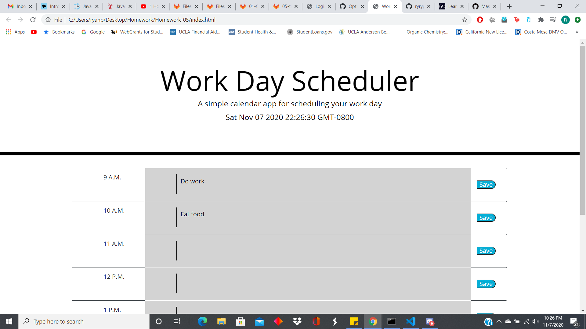

# Homework-05

This repository contains an app that runs in browser and that acts as a work day scheduler.  It was made in order to continue practicing with JavaScript as well as JQuery.

The site can be reached here: [Day Planner](https://ryryp97.github.io/Homework-05/) 

Here is what the site looks like : 

### Usage

To operate on the site, just click on the text area nested within each time slot and type whatever tasks youd like to get done during that time.  Then, click the save button for that time slot to store your text data in local storage, it'll still be there even if you refresh the page!

### Credits

I'd like to thank W3Schools and many threads on Stack Overflow for their help in the creation of this website.

### License

MIT License

Copyright (c) 2020 Ryan Petrecca

Permission is hereby granted, free of charge, to any person obtaining a copy of this software and associated documentation files (the "Software"), to deal in the Software without restriction, including without limitation the rights to use, copy, modify, merge, publish, distribute, sublicense, and/or sell copies of the Software, and to permit persons to whom the Software is furnished to do so, subject to the following conditions:

The above copyright notice and this permission notice shall be included in all copies or substantial portions of the Software.

THE SOFTWARE IS PROVIDED "AS IS", WITHOUT WARRANTY OF ANY KIND, EXPRESS OR IMPLIED, INCLUDING BUT NOT LIMITED TO THE WARRANTIES OF MERCHANTABILITY, FITNESS FOR A PARTICULAR PURPOSE AND NONINFRINGEMENT. IN NO EVENT SHALL THE AUTHORS OR COPYRIGHT HOLDERS BE LIABLE FOR ANY CLAIM, DAMAGES OR OTHER LIABILITY, WHETHER IN AN ACTION OF CONTRACT, TORT OR OTHERWISE, ARISING FROM, OUT OF OR IN CONNECTION WITH THE SOFTWARE OR THE USE OR OTHER DEALINGS IN THE SOFTWARE.